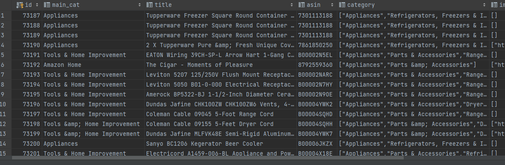
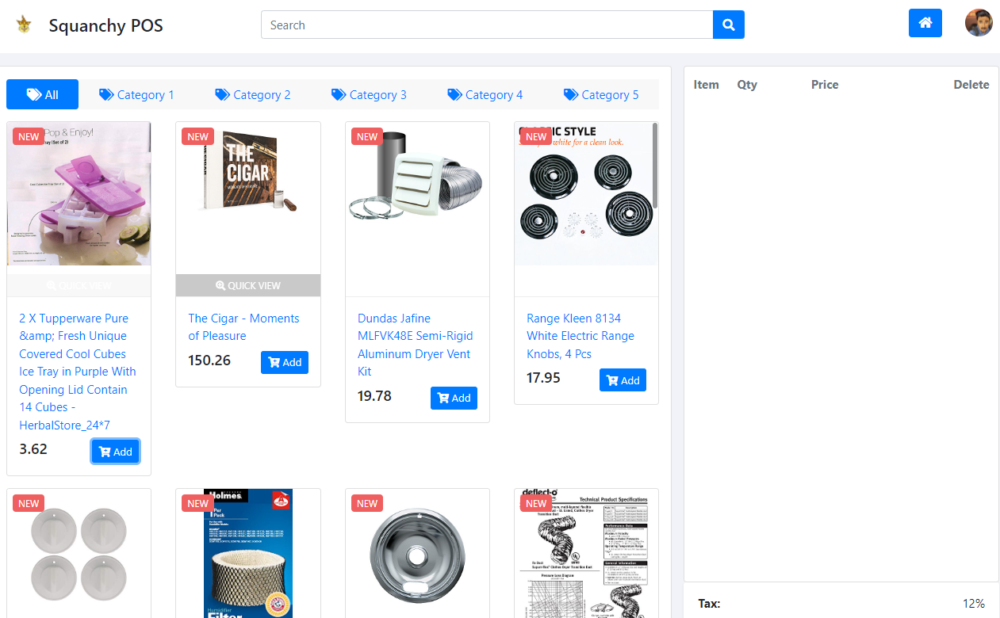

# aw06

- 下载了meta_All_Beauty.json和meta_Appliances.json两个数据集

- 建立数据表，使用Mybatis-Plus持久层框架将数据存入数据库中，其中category等List类型字段编写typeHandler处理（使用fastjson）

- 在aw04中，同样使用Mybatis-Plus持久层框架读取数据，编写实现了PosDB的Amazon类，将aw06中的Product读取并转化为aw04中的Product，结果如下：

[Amazon Review Data (2018)](https://nijianmo.github.io/amazon/index.html) has a huge products metadata set of multiple categories.

|category| reviews | metadata |
|--| -- | -- |
|Amazon Fashion|reviews (883,636 reviews)|metadata (186,637 products)|
|All Beauty|reviews (371,345 reviews)|metadata (32,992 products)|
|Appliances|reviews (602,777 reviews)|metadata (30,459 products)|
| ... |
|Tools and Home Improvement|reviews (9,015,203 reviews)|metadata (571,982 products)|
Toys and Games|reviews (8,201,231 reviews)|metadata (634,414 products)|
Video Games|reviews (2,565,349 reviews)|metadata (84,893 products)|

Please finish the following tasks:

- Download no less than two categories of these metadata.
- Referring the example code in this repo, convert each line in the downloaded files into a POJO of `Product` class and save the object in a database like MySQL. 
- Integrate the database containing Amazon products with your own AW04 project and build an Amazon WebPOS system.

And, of course, always try to make the system run as fast as possible.