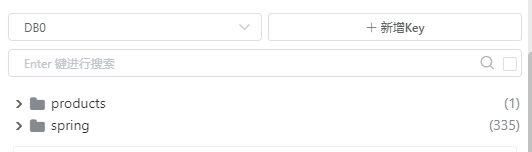

# 实验报告

## 1

> Build a docker image for this application and performance a load testing against it.

### 实验过程

添加maven插件

```xml
<plugin>
	<groupId>com.google.cloud.tools</groupId>
	<artifactId>jib-maven-plugin</artifactId>
	<version>3.2.0</version>
	<configuration>
		<to>
			<image>app-pos</image>
		</to>
	</configuration>
</plugin>
```

运行如下命令生成docker镜像

```shell
mvn compile jib:dockerBuild
```


运行如下三行命令，运行三个分别使用0.5,1,2个CPU的容器

```shell
docker run -d  --name app-pos-0.5 --cpus=0.5 -p 18080:8080 app-pos
docker run -d  --name app-pos-1 --cpus=1 -p 28080:8080 app-pos
docker run -d  --name app-pos-2 --cpus=2 -p 38080:8080 app-pos
```

编写Gatling脚本如下，访问一次主页，添加一个物品：

```java
ScenarioBuilder scn =
	scenario("Test Pos")
		.exec(http("request").get("/"))
		.exec(http("request").get("/add?pid=13284888"));
```

分别模拟20,100,500个用户访问

```shell
setUp(scn.injectOpen(atOnceUsers(100)).protocols(httpProtocol)); //500,1000
```

### 实验结果

下面是app-pos-0.5的三次测试的详细信息，并发量分别为20,100,500

```shell
0.5CPU，20
================================================================================
---- Global Information --------------------------------------------------------
> request count                                         40 (OK=40     KO=0     )
> min response time                                    103 (OK=103    KO=-     )
> max response time                                    822 (OK=822    KO=-     )
> mean response time                                   327 (OK=327    KO=-     )
> std deviation                                        188 (OK=188    KO=-     )
> response time 50th percentile                        311 (OK=311    KO=-     )
> response time 75th percentile                        440 (OK=440    KO=-     )
> response time 95th percentile                        727 (OK=727    KO=-     )
> response time 99th percentile                        821 (OK=821    KO=-     )
> mean requests/sec                                     20 (OK=20     KO=-     )
---- Response Time Distribution ------------------------------------------------
> t < 800 ms                                            38 ( 95%)
> 800 ms < t < 1200 ms                                   2 (  5%)
> t > 1200 ms                                            0 (  0%)
> failed                                                 0 (  0%)
================================================================================
0.5CPU，100
================================================================================
---- Global Information --------------------------------------------------------
> request count                                        200 (OK=200    KO=0     )
> min response time                                    197 (OK=197    KO=-     )
> max response time                                   4494 (OK=4494   KO=-     )
> mean response time                                  1907 (OK=1907   KO=-     )
> std deviation                                        902 (OK=902    KO=-     )
> response time 50th percentile                       1839 (OK=1839   KO=-     )
> response time 75th percentile                       2612 (OK=2612   KO=-     )
> response time 95th percentile                       3405 (OK=3405   KO=-     )
> response time 99th percentile                       3995 (OK=3995   KO=-     )
> mean requests/sec                                 33.333 (OK=33.333 KO=-     )
---- Response Time Distribution ------------------------------------------------
> t < 800 ms                                            26 ( 13%)
> 800 ms < t < 1200 ms                                  21 ( 11%)
> t > 1200 ms                                          153 ( 77%)
> failed                                                 0 (  0%)
================================================================================
0.5CPU，500
================================================================================
---- Global Information --------------------------------------------------------
> request count                                       1000 (OK=1000   KO=0     )
> min response time                                     86 (OK=86     KO=-     )
> max response time                                  26865 (OK=26865  KO=-     )
> mean response time                                 10351 (OK=10351  KO=-     )
> std deviation                                       6235 (OK=6235   KO=-     )
> response time 50th percentile                       9396 (OK=9396   KO=-     )
> response time 75th percentile                      14811 (OK=14811  KO=-     )
> response time 95th percentile                      22796 (OK=22796  KO=-     )
> response time 99th percentile                      25491 (OK=25491  KO=-     )
> mean requests/sec                                 34.483 (OK=34.483 KO=-     )
---- Response Time Distribution ------------------------------------------------
> t < 800 ms                                            36 (  4%)
> 800 ms < t < 1200 ms                                   9 (  1%)
> t > 1200 ms                                          955 ( 96%)
> failed                                                 0 (  0%)
================================================================================
```

可以看到，随着并发量的增大，服务器的延迟越来越高

由于篇幅限制，下面只展示app-pos-1，app-pos-2的结果（平均响应延迟），且以下数据均在进行过一次500并发量的测试后（预热），再进行测试的结果

| 并发量\|容器 | app-pos-0.5 | app-pos-1 | app-pos-2 |
| ------------ | ----------- | --------- | --------- |
| 20           | 327         | 215       | 126       |
| 100          | 1907        | 1046      | 617       |
| 500          | 10351       | 5586      | 2614      |

可以看到，垂直拓展后，1,2,3号容器的平均响应延迟不断降低，并发量维度上，并发量越大，平均响应延迟越高

## 2

> Make this system horizontally scalable by using haproxy and performance a load testing against it.

### 实验过程

此时模拟500个用户访问

```
setUp(scn.injectOpen(atOnceUsers(500)).protocols(httpProtocol)); 
```

执行如下命令，启动4个分别使用1个CPU的容器

```
docker run -d  --name app-pos-1-1 --cpus=1 -p 18080:8080 app-pos
docker run -d  --name app-pos-1-2 --cpus=1 -p 28080:8080 app-pos
docker run -d  --name app-pos-1-3 --cpus=1 -p 38080:8080 app-pos
docker run -d  --name app-pos-1-4 --cpus=1 -p 48080:8080 app-pos
```

下载haproxy，编写配置文件如下：

```
defaults
    mode tcp
frontend lb-app-pos
    bind *:8080
    default_backend servers
backend servers
    balance roundrobin
    server server1 localhost:18080
    server server2 localhost:28080
    server server3 localhost:38080
    server server4 localhost:48080
```

启动haproxy：

```shell
haproxy.exe -f haproxy.cfg
```

### 实验结果

实验结果如下：

```shell
server1
================================================================================
---- Global Information --------------------------------------------------------
> request count                                       1000 (OK=1000   KO=0     )
> min response time                                     90 (OK=90     KO=-     )
> max response time                                  11012 (OK=11012  KO=-     )
> mean response time                                  4091 (OK=4091   KO=-     )
> std deviation                                       2605 (OK=2605   KO=-     )
> response time 50th percentile                       3526 (OK=3526   KO=-     )
> response time 75th percentile                       5985 (OK=5985   KO=-     )
> response time 95th percentile                       9119 (OK=9119   KO=-     )
> response time 99th percentile                      10501 (OK=10501  KO=-     )
> mean requests/sec                                 83.333 (OK=83.333 KO=-     )
---- Response Time Distribution ------------------------------------------------
> t < 800 ms                                            93 (  9%)
> 800 ms < t < 1200 ms                                  46 (  5%)
> t > 1200 ms                                          861 ( 86%)
> failed                                                 0 (  0%)
================================================================================
server1,server2
================================================================================
---- Global Information --------------------------------------------------------
> request count                                       1000 (OK=1000   KO=0     )
> min response time                                     95 (OK=95     KO=-     )
> max response time                                   7926 (OK=7926   KO=-     )
> mean response time                                  2365 (OK=2365   KO=-     )
> std deviation                                       1826 (OK=1826   KO=-     )
> response time 50th percentile                       1845 (OK=1845   KO=-     )
> response time 75th percentile                       3112 (OK=3112   KO=-     )
> response time 95th percentile                       6276 (OK=6276   KO=-     )
> response time 99th percentile                       7533 (OK=7533   KO=-     )
> mean requests/sec                                111.111 (OK=111.111 KO=-     )
---- Response Time Distribution ------------------------------------------------
> t < 800 ms                                           192 ( 19%)
> 800 ms < t < 1200 ms                                  96 ( 10%)
> t > 1200 ms                                          712 ( 71%)
> failed                                                 0 (  0%)
================================================================================
server1,server2,server3
================================================================================
---- Global Information --------------------------------------------------------
> request count                                       1000 (OK=1000   KO=0     )
> min response time                                     60 (OK=60     KO=-     )
> max response time                                   6376 (OK=6376   KO=-     )
> mean response time                                  1798 (OK=1798   KO=-     )
> std deviation                                       1454 (OK=1454   KO=-     )
> response time 50th percentile                       1484 (OK=1484   KO=-     )
> response time 75th percentile                       2694 (OK=2694   KO=-     )
> response time 95th percentile                       4584 (OK=4584   KO=-     )
> response time 99th percentile                       5576 (OK=5576   KO=-     )
> mean requests/sec                                142.857 (OK=142.857 KO=-     )
---- Response Time Distribution ------------------------------------------------
> t < 800 ms                                           341 ( 34%)
> 800 ms < t < 1200 ms                                  97 ( 10%)
> t > 1200 ms                                          562 ( 56%)
> failed                                                 0 (  0%)
================================================================================
server1,server2,server3,server4
================================================================================
---- Global Information --------------------------------------------------------
> request count                                       1000 (OK=1000   KO=0     )
> min response time                                     89 (OK=89     KO=-     )
> max response time                                   5911 (OK=5911   KO=-     )
> mean response time                                  1506 (OK=1506   KO=-     )
> std deviation                                       1197 (OK=1197   KO=-     )
> response time 50th percentile                       1166 (OK=1166   KO=-     )
> response time 75th percentile                       2122 (OK=2122   KO=-     )
> response time 95th percentile                       4017 (OK=4017   KO=-     )
> response time 99th percentile                       5127 (OK=5127   KO=-     )
> mean requests/sec                                142.857 (OK=142.857 KO=-     )
---- Response Time Distribution ------------------------------------------------
> t < 800 ms                                           385 ( 39%)
> 800 ms < t < 1200 ms                                 137 ( 14%)
> t > 1200 ms                                          478 ( 48%)
> failed                                                 0 (  0%)
================================================================================
```

可以看到，从一台服务器水平拓展到多台服务器后，平均响应时延不断减少，在haproxy的复杂均衡下，服务器的性能上升

## 3

> Take care of the **cache missing** problem (you may cache the products from jd.com) and **session sharing** problem (you may use a standalone mysql db or a redis cluster). Performance load testings.

### 实验过程

#### cache missing

- 在WebPOSApplication类上加上@EnableCaching注解
- 在Service类的products方法上加上@Cacheable(value = "products")注解
- 在pom.xml内导入依赖
- 在application.properties配置文件内写入

```
spring.cache.type=redis
spring.redis.host=localhost
spring.redis.port=6379
```

- 启动redis在主机的6379号端口即可

#### session sharing

- 添加SessionConfig配置类
- 添加pom依赖

### 实验结果

windows下的redis版本太低了不支持搭建集群，docke容器搞了半天最后还是没成功，于是下面的实验只能用单个节点的redis...

此时模拟500个用户访问,使用2中水平拓展的四台使用一个CPU的服务器，结果如下：

```shell
================================================================================
---- Global Information --------------------------------------------------------
> request count                                       1000 (OK=1000   KO=0     )
> min response time                                   1458 (OK=1458   KO=-     )
> max response time                                   3219 (OK=3219   KO=-     )
> mean response time                                  2234 (OK=2234   KO=-     )
> std deviation                                        477 (OK=477    KO=-     )
> response time 50th percentile                       2151 (OK=2151   KO=-     )
> response time 75th percentile                       2565 (OK=2565   KO=-     )
> response time 95th percentile                       3037 (OK=3037   KO=-     )
> response time 99th percentile                       3192 (OK=3192   KO=-     )
> mean requests/sec                                166.667 (OK=166.667 KO=-     )
---- Response Time Distribution ------------------------------------------------
> t < 800 ms                                             0 (  0%)
> 800 ms < t < 1200 ms                                   0 (  0%)
> t > 1200 ms                                         1000 (100%)
> failed                                                 0 (  0%)
================================================================================
```

可以看到，相比于2中的结果，平均实验甚至有所下降，可能是因为模拟访问只访问一次'/'与一次’/add'，并没有很好的利用缓存，反而由于写入缓存影响了性能，于是修改访问逻辑为：

```java
ScenarioBuilder scn =
	scenario("Test Pos")
		.exec(http("request_1").get("/"))
		.exec(http("request_2").get("/"))
		.exec(http("request_3").get("/"))
		.exec(http("request_4").get("/"))
		.exec(http("request_5").get("/"))
		.exec(http("request_6").get("/add?pid=13284888"));
```

意图更好的命中缓存，结果如下：

```shell
================================================================================
---- Global Information --------------------------------------------------------
> request count                                       3000 (OK=3000   KO=0     )
> min response time                                    650 (OK=650    KO=-     )
> max response time                                   3494 (OK=3494   KO=-     )
> mean response time                                  1919 (OK=1919   KO=-     )
> std deviation                                        398 (OK=398    KO=-     )
> response time 50th percentile                       1903 (OK=1903   KO=-     )
> response time 75th percentile                       2042 (OK=2042   KO=-     )
> response time 95th percentile                       2837 (OK=2837   KO=-     )
> response time 99th percentile                       3051 (OK=3051   KO=-     )
> mean requests/sec                                230.769 (OK=230.769 KO=-     )
---- Response Time Distribution ------------------------------------------------
> t < 800 ms                                             8 (  0%)
> 800 ms < t < 1200 ms                                  73 (  2%)
> t > 1200 ms                                         2919 ( 97%)
> failed                                                 0 (  0%)
================================================================================
```

可以看到，平均响应时间相比上面有所下降，甚至<1200ms的响应从了0%到2%，推测是由于命中了缓存从而快速响应，体现了缓存的作用。

### redis集群

参照网上的教程使用ruby脚本在windows上直接搭建了redis集群

```
redis-trib.rb create --replicas 1 127.0.0.1:30001 127.0.0.1:30002 127.0.0.1:30003 127.0.0.1:30004 127.0.0.1:30005 127.0.0.1:30006
```

结果如下：

```
================================================================================
---- Global Information --------------------------------------------------------
> request count                                       3000 (OK=3000   KO=0     )
> min response time                                     17 (OK=17     KO=-     )
> max response time                                   1557 (OK=1557   KO=-     )
> mean response time                                   664 (OK=664    KO=-     )
> std deviation                                        231 (OK=231    KO=-     )
> response time 50th percentile                        666 (OK=666    KO=-     )
> response time 75th percentile                        781 (OK=781    KO=-     )
> response time 95th percentile                       1024 (OK=1024   KO=-     )
> response time 99th percentile                       1417 (OK=1417   KO=-     )
> mean requests/sec                                    600 (OK=600    KO=-     )
---- Response Time Distribution ------------------------------------------------
> t < 800 ms                                          2346 ( 78%)
> 800 ms < t < 1200 ms                                 563 ( 19%)
> t > 1200 ms                                           91 (  3%)
> failed                                                 0 (  0%)
================================================================================
```

共计500个模拟用户访问，seesion与对应的expires共计1000条，每个redis服务器大约330条



# WebPOS

The demo shows a web POS system , which replaces the in-memory product db in aw03 with a one backed by 京东.


To run

```shell
mvn clean spring-boot:run
```

Currently, it creates a new session for each user and the session data is stored in an in-memory h2 db. 
And it also fetches a product list from jd.com every time a session begins.

1. Build a docker image for this application and performance a load testing against it.
2. Make this system horizontally scalable by using haproxy and performance a load testing against it.
3. Take care of the **cache missing** problem (you may cache the products from jd.com) and **session sharing** problem (you may use a standalone mysql db or a redis cluster). Performance load testings.

Please **write a report** on the performance differences you notices among the above tasks.
